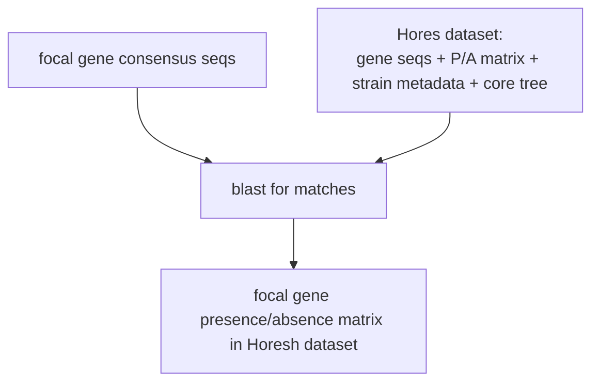

# Methods

## Rationale

The aim of our analysis is to survey the presence of a panel of *focal genes* across the *E. coli* species.

These *focal genes of interest* have been shown by experiments to confer a fitness advantage to *E. coli* isolates colonizing the mouse gut, **only in the presence of a complex microbiota**. In practice, loss of these genes penalises colonization in conventional mice but not in germ-free / simplified-microbiota conditions.

As part of our analysis, we want to understand how these focal genes are distributed across the broad *E. coli* species. To do this, we rely on the genome collection introduced in Horesh et al. 2021.

## The Horesh *E. coli* collection

In [Horesh et al. 2021](https://doi.org/10.1099/mgen.0.000499) the authors introduced a comprehensive pangenome collection of *E. coli* and *Shigella* genomes. The collection comprises more than 10,000 curated *E. coli* and *Shigella* assemblies with associated metadata; the authors performed gene clustering on the 50 largest lineages (~7,000 genomes) and provide both a pangenome reference and a binary gene presence/absence matrix for those isolates, together with a 500-genome core-genome tree. We restrict our analysis to the clustered subset. Each isolate carries a sequence type (ST) and phylogroup annotation.

## "Microbiota-dependent" focal genes

These are a curated panel of 506 genes that were shown in upstream *in vivo* experiments to confer a fitness advantage to *E. coli* isolates colonizing the mouse gut, **only in the presence of a complex microbiota**. Their consensus sequences (from our PanX gene clustering) and per-gene metadata can be found in `config/focal_genes/` and is used as input to downstream analyses.

## Identification of focal genes in the Horesh collection

We map the consensus sequences of our focal genes to the Horesh pangenome reference using nucleotide BLAST, retaining hits with percent identity $\geq$ 85 % and query coverage $\geq$ 85 %. In case of multiple matches we merge the corresponding Horesh clusters together, and genes that fail to match any cluster above the threshold (21 out of 506) are dropped. The output is a restricted presence/absence matrix of focal genes in isolates of the collection, used as input to all downstream analyses.

## Identification of high-load strains

After inspecting the [distribution of the total number of focal genes](../results/figs/st_boxplots.png) carried by each strain in the collection, stratified by sequence type (ST), we note the presence of a tail of STs (mainly of phylogroup B2) that carry a much higher number of focal genes than the rest. We label strains carrying at least 330 focal genes as *high-load*.

## Genes enriched in high-load strains

To identify genes that are enriched in high-load strains, [we compare the frequency of each gene in high-load strains to its frequency in the remaining (other) strains](../results/figs/gene_enrichment_scatter.png). Moreover, to prioritise genes that are not only enriched but also widely distributed across, we compute for each the **ST participation ratio.**, defined as:

$$
r = \frac{\left(\sum_i f_i\right)^2}{\sum_i f_i^2}
$$

where $f_i$ is the frequency of the gene in ST $i$ (fraction of ST-$i$ isolates carrying it), summed over STs with ≥10 isolates. $r$ quantifies the effective number of STs in which the gene is commonly found.

## Pipeline overview and additional outputs

Our results are summarized in the figures described in [results.md](results.md). In addition to these, the pipeline generates other relevant CSV artefacts. The main ones are listed here:

- `results/presence_absence.csv` — gene presence/absence matrix of focal genes in the Horesh collection.
- `results/homology/focal_vs_horesh_mapping.csv` and `focal_vs_horesh_unmatched.txt` — focal-gene $\to$ Horesh-cluster BLAST mapping and the list of focal genes with no acceptable hit.
- `results/figs/st_isolate_counts.csv` — per-ST counts (in the dataset and in the sub-sampled core-genome tree).
- `results/figs/st_pairwise_distance.csv` — ST $\times$ ST average pairwise-distance matrix, computed from the core-genome tree of the Horesh collection.
- `results/figs/phylo_heatmap_pa_matrix.csv` — sub-matrix of the larger presence/absence matrix rendered in the phylo heatmap.
