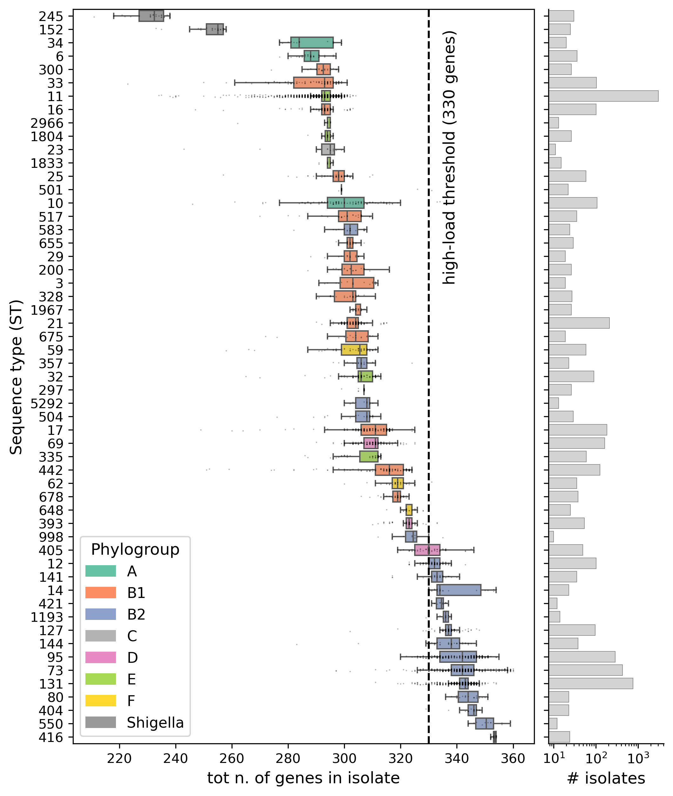
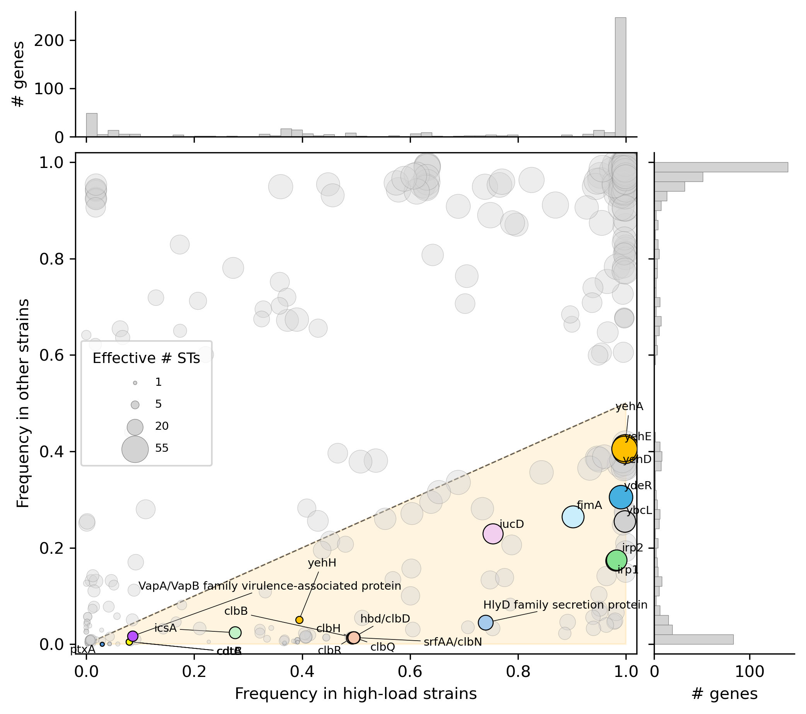
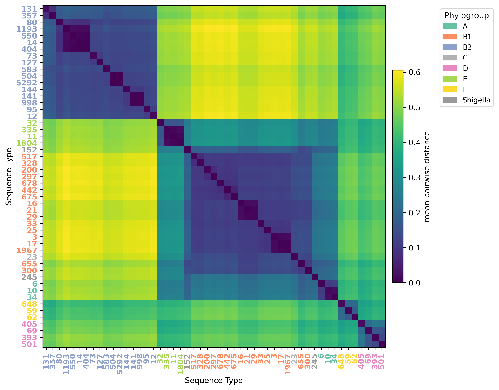
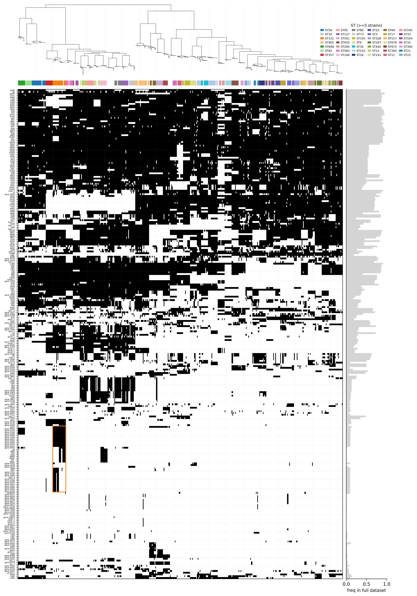

# Results

Here is a brief description of the figures produced by the pipeline. See [methods.md](methods.md) for definitions and the pipeline overview.

## ST gene-load boxplots

Distribution of the number of focal genes carried by each *E. coli* strain in the Horesh collection, grouped by sequence type (only STs with $\geq 10$ isolates) and ordered by ascending median count. Each box is coloured by the phylogroup of the ST. The vertical dashed line marks the high-load threshold (330 genes). The side bar reports the number of isolates per ST on a log scale.

## Per-gene enrichment in high-load strains

Per-gene frequency in high-load strains plotted against frequency in the remaining (other) strains, across the focal-gene panel. Marker size encodes the *ST participation ratio* (see methods). The orange wedge marks the region of $\geq$ 2-fold enrichment in high-load strains, i.e. freq\_high-load > 2 · freq\_other. Genes from a curated panel of virulence/pathogenicity markers are highlighted and labelled. The marginal histograms on the top and right show the distribution of each frequency across all focal genes.

## ST pairwise phylogenetic distances

Mean tip-to-tip phylogenetic distance between isolates of pairs of STs on the Horesh 500-genome core tree, restricted to STs with $\geq 10$ isolates in the dataset and at least one representative in the tree. The matrix is reordered by average-linkage hierarchical clustering on the distance values. ST labels are coloured by the ST's phylogroup.

## Phylogeny × focal-gene presence/absence

Presence/absence of non-core focal genes (full-dataset frequency < 0.95) across the isolates of the Horesh core-genome tree (shown on top). STs with $\geq 5$ isolates in the tree are coloured according to the legend on the right; remaining isolates are left white. The orange rectangle highlights a ST131-specific region of interest. The right-hand bar plot reports the frequency of each gene in the full dataset.
